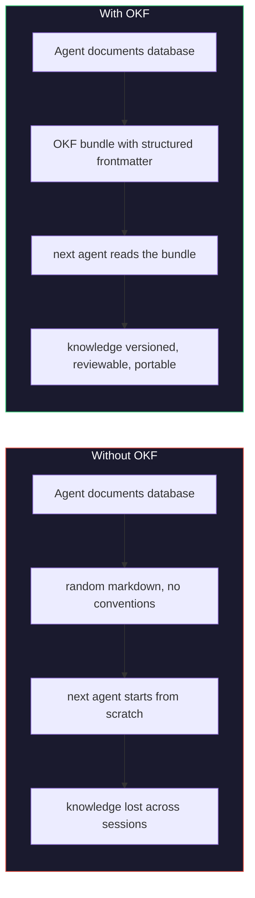
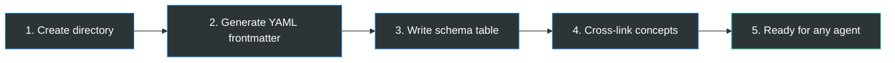

<div align="center">

# 🧠 OKF Skill

**The Open Knowledge Format skill for coding agents.**

Teaches AI agents to store, retrieve, and manage knowledge using [OKF](https://cloud.google.com/blog/products/data-analytics/how-the-open-knowledge-format-can-improve-data-sharing), an open specification from Google.

[](LICENSE)
[](https://github.com/GoogleCloudPlatform/knowledge-catalog/blob/main/okf/SPEC.md)
[](#install)
[](#contributing)


</div>

---

## Why this exists

Foundation models are powerful, but they lack **context**. The knowledge agents need (table schemas, API docs, runbooks, metrics) lives in fragmented, incompatible systems. Every agent builder solves the same context-assembly problem from scratch.

**[OKF](https://github.com/GoogleCloudPlatform/knowledge-catalog/tree/main/okf)** is Google's answer: a minimal, vendor-neutral format where knowledge lives as **markdown files with YAML frontmatter**, organized in directories, cross-linked, version-controllable, and readable by both humans and agents.

This skill makes your coding agent **use OKF by default**, so knowledge is structured, portable, and compounds across sessions.

---

## How it works



---

## OKF in action

**You say:**

> *"Document my Postgres orders table as an OKF bundle"*

**Your agent produces:**

```
knowledge/
├── index.md
├── datasets/
│   ├── index.md
│   └── sales.md
└── tables/
    ├── index.md
    ├── orders.md        <-- this file
    └── customers.md
```

```markdown
---
type:        Table
title:       Orders
description: One row per completed customer order
tags:        [sales, orders]
timestamp:   2026-06-17T00:00:00Z
---

# Schema

| Column       | Type   | Description                          |
|--------------|--------|--------------------------------------|
| order_id     | STRING | Unique order identifier              |
| customer_id  | STRING | FK to customers                      |
| total_usd    | NUMERIC| Order total in USD                   |
| placed_at    | TIMESTAMP | When the order was placed         |

# Related

See customers.md for the join key.
```

**What just happened:**



---

## Install

From within Claude Code:

```
/plugin marketplace add catancs/okf-skill
/plugin install okf-skill@okf-skill
```

---

## Resources

- **[OKF Specification (v0.1)](https://github.com/GoogleCloudPlatform/knowledge-catalog/blob/main/okf/SPEC.md)** (the full spec, it's short)
- **[Google Cloud Blog](https://cloud.google.com/blog/products/data-analytics/how-the-open-knowledge-format-can-improve-data-sharing)** (the announcement post)
- **[Reference Agent & Samples](https://github.com/GoogleCloudPlatform/knowledge-catalog/tree/main/okf)** (Google's proof-of-concept implementation)
- **[Karpathy's LLM Wiki](https://gist.github.com/karpathy/442a6bf555914893e9891c11519de94f)** (the pattern that inspired OKF)

---

## Contributing

Open source. Use it, fork it, improve it.

If the OKF spec evolves, update the skill. If you find patterns that work better, share them. The value of a knowledge format comes from adoption, not ownership.

---

<div align="center">

Built by [@catancs](https://github.com/catancs) . MIT licensed

</div>
